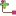

# FreeDiagram
[//]: # (Do not edit this file, which is automatically generated)

This ModelSlot represents access to a Diagram without any DiagramSpecification conformance


---

## Usage

```java
[visibility] [cardinality] Diagram <identifier> with FreeDiagram([options]);
```

or

```java
[visibility] [cardinality] Diagram <identifier> with DIAGRAM::FreeDiagram([options]);
```

where

- `visibility` is default (unspecified), 'public', 'protected' or 'private'
- `cardinality` is \[0,1\] (unspecified), \[0,\*\] or \[1,\*\]
- \<identifier\> is the name of declared model slot variable

---

## Configuration

| Property        | Type                    | &nbsp;Required&nbsp;  |
| --------------- |-------------------------| :------:|
| `container` &nbsp; | `?` &nbsp; | no |
| `isReadOnly` &nbsp; | `boolean` &nbsp; | no |
| `isRequired` &nbsp; | `boolean` &nbsp; | no |

---

- `container` : 
- `isReadOnly` : 
- `isRequired` : 

---

## Examples

```java
Diagram myDiagram with DIAGRAM::FreeDiagram();
```

Declares a model slot called 'myDiagram' with resulting type 'Diagram', realized through the 'FreeDiagram' model slot


---

## Roles

 -  [`ShapeRole`](ShapeRole.md) : No documentation yet
 -  [`ConnectorRole`](ConnectorRole.md) : No documentation yet
 -  [`DiagramRole`](DiagramRole.md) : No documentation yet

---

## Behaviours

 -  [`DropScheme`](DropScheme.md) : No documentation yet
 -  [`DrawRectangleScheme`](DrawRectangleScheme.md) : No documentation yet
 -  [`LinkScheme`](LinkScheme.md) : No documentation yet
 -  [`DiagramNavigationScheme`](DiagramNavigationScheme.md) : No documentation yet

---

## Edition actions

 -  [`CreateDiagram`](CreateDiagram.md) : This edition primitive addresses the creation of a new diagram.
 -  [`AddShape`](AddShape.md) : This edition primitive addresses the creation of a new shape in a diagram.
 -  [`AddConnector`](AddConnector.md) : This edition primitive addresses the creation of a new connector linking two shapes in a diagram
 -  [`GraphicalAction`](GraphicalAction.md) : No documentation yet

---

## Javadoc

[org.openflexo.technologyadapter.diagram.FreeDiagramModelSlot](./apidocs/org/openflexo/technologyadapter/diagram/FreeDiagramModelSlot.md)

