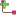

# FreeDiagram
[//]: # (Do not edit this file, which is automatically generated)

This ModelSlot represents access to a Diagram without any DiagramSpecification conformance

---

## Edition actions

 -  [`CreateDiagram`](CreateDiagram.md) : This edition primitive addresses the creation of a new diagram.
 -  [`AddShape`](AddShape.md) : This edition primitive addresses the creation of a new shape in a diagram.
 -  [`AddConnector`](AddConnector.md) : This edition primitive addresses the creation of a new connector linking two shapes in a diagram
 -  [`GraphicalAction`](GraphicalAction.md) : No documentation yet

